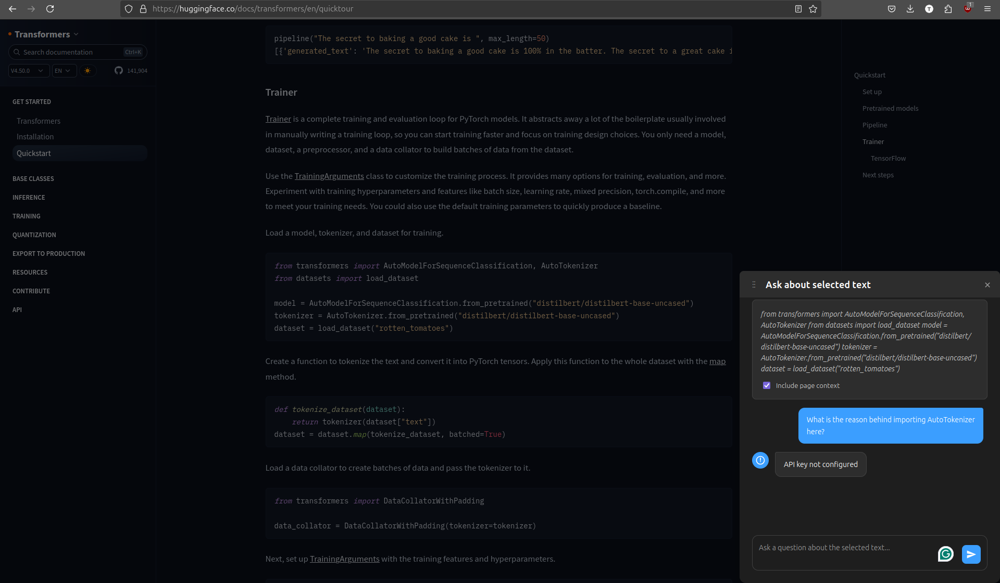

# Browse with AI - Firefox Extension

A Firefox extension that allows you to select text on any webpage and ask questions about it using various AI providers. The extension provides a modern, user-friendly interface with support for multiple AI models and a chat-like experience.

## Features

- **Text Selection**: Select any text on a webpage to analyze
- **Multiple AI Providers**: Support for various AI providers including:
  - OpenAI (GPT-3.5, GPT-4)
  - Anthropic (Claude 2, Claude 3)
  - Google (Gemini)

- **Modern UI/UX**:
  - Draggable popup window with visual drag handle
  - Light and dark theme support
  - Smooth animations and transitions
  - Focus/blur states for better multitasking
  - Chat-like interface with AI provider logos
  - Context-aware message bubbles
  - Responsive design

- **Smart Features**:
  - Context preservation
  - Conversation history
  - Position memory
  - Automatic theme detection
  - Smooth scrolling
  - Loading states and error handling

## Example



The extension allows you to select text from any webpage (like documentation shown above) and ask questions about it. The popup interface appears with your selected text and provides an intuitive chat interface to interact with various AI models.

## Installation

1. Clone this repository
2. Open Firefox and go to `about:debugging`
3. Click "This Firefox" on the left sidebar
4. Click "Load Temporary Add-on"
5. Navigate to the extension directory and select `manifest.json`

## Usage

1. Select any text on a webpage
2. Right-click and choose "Ask AI about selection"
3. The popup will appear in the bottom right corner
4. Type your question and press Enter
5. View the AI's response in a chat-like interface
6. Continue the conversation or close the popup

## Configuration

The extension supports configuration through the browser's storage:

- `apiKey`: Your API key for the selected provider
- `model`: The AI model to use
- `provider`: The AI provider to use
- `popupX` and `popupY`: Last position of the popup window

## Development

### Project Structure

```
browse_with_ai/
├── manifest.json
├── background.js
├── content.js
├── popup.html
├── popup.js
├── icons/
│   ├── icon-48.png
│   ├── icon-96.png
│   └── icon-128.png
└── README.md
```

### Key Components

- `manifest.json`: Extension configuration
- `background.js`: Handles context menu and messaging
- `content.js`: Manages popup UI and interactions
- `popup.html/js`: Settings interface
- `icons/`: Extension icons

### Building

1. Make your changes
2. Test in Firefox using `about:debugging`
3. Package for distribution (instructions to be added)

## Contributing

Contributions are welcome! Please feel free to submit a Pull Request.

## License

This project is licensed under the MIT License - see the LICENSE file for details.

## Acknowledgments

- Icons from [Phosphor Icons](https://phosphoricons.com/)
- Inspired by various AI-powered browser extensions 